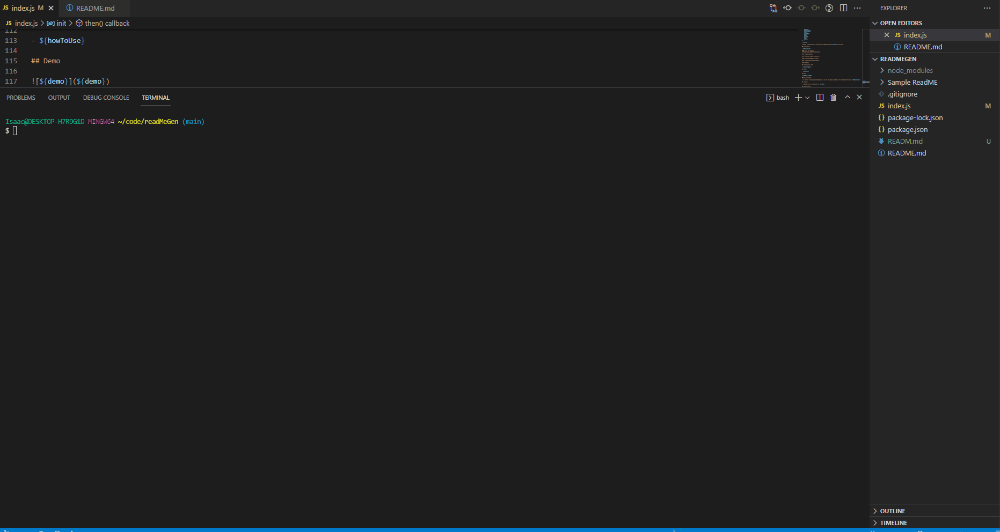

# ReadMe Generator

## Description

- This is a node.js based application that generates a README file to your local repo

### Table of Contents  
[Technologies used](#technologies)

[How to use](#How-to-use)

[How to install](#How-to-install)

[Report Issues](#Report-issues)

[How to Contribute](#Contribute)

[Demo](#Demo)

## Technologies Used:

- node.JS, JavaScript, FileSystem (FS), and Inquirer

## How-to-use:

- Clone the repo to your local machine. Open in your terminal (with node installed) and run the command: npm install, then in the terminal run the command node index.js, answer the questions provided and a README should be generated

## How-to-install:

- To install the necessary depenencies, run the following command npm install or npm i

## Demo

## Report-issues:

* [isaac.petersen5@gmail.com](isaac.petersen5@gmail.com)
* [https://github.com/idpetersen](https://github.com/idpetersen)
* You can either email me with the provided email address or contact me on GitHub

## Contribute:

* The way you can contribute to this repo is to Email me or contact me on GitHub
